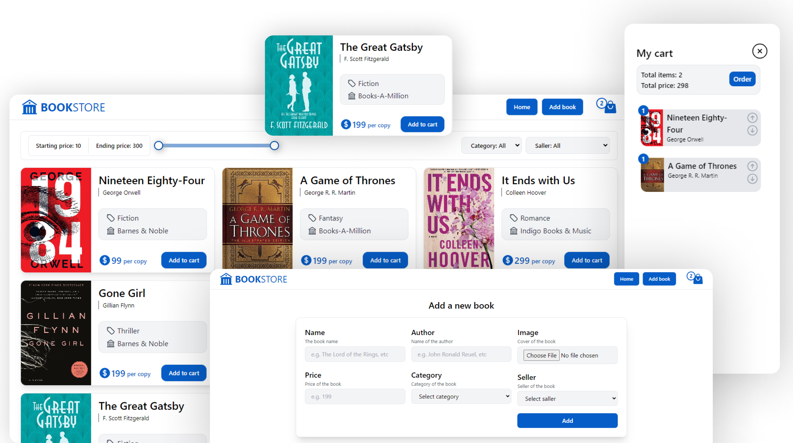

# Book Store | Task
### Video link: https://drive.google.com/file/d/1O6_Xto-xWAQd8sOhu0S4XgvHa9jzC14c/view?usp=sharing

### Api documentation: https://documenter.getpostman.com/view/13756354/2s93z5AQhd

## Features: 
- Adding a new book
- Displaying the books
- Filtering the books (by price range, category, seller)
- Cart (+Cookie)
- Placing order (+order items), cart to order and oder item model
  
## Tech-stack:
- Django Rest Framework
- React Js
- Tailwindcss